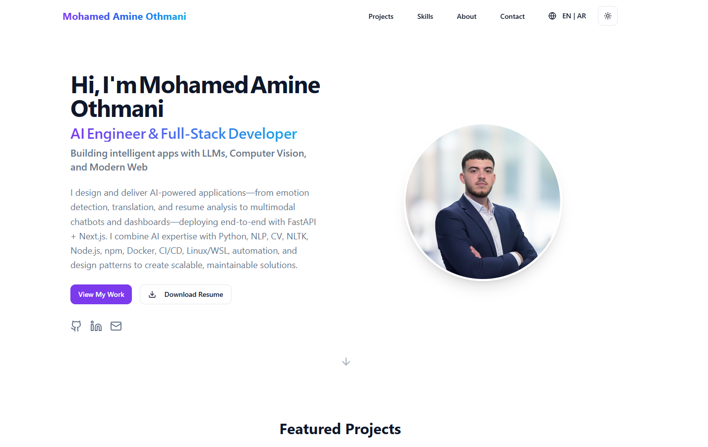

# 👨‍💻 Mohamed Amine Othmani – Portfolio

## 🚀 Overview

This is my personal portfolio website showcasing my skills, projects, and experience as an AI Engineer and Full-Stack Developer. Built with modern web technologies, it highlights my work in AI, NLP, Computer Vision, and scalable web applications.

---

## 🛠️ Tech Stack

- **Frontend**: Next.js, React, Tailwind CSS  
- **Backend**: Next.js API routes (for contact form/email handling)  
- **Deployment**: Vercel  
- **Languages**: TypeScript, JavaScript

---

## 📁 Features

- 🌐 Multilingual support (English & Arabic)  
- 🧠 Skills section with categorized technologies  
- 📂 Projects with live demos and GitHub links  
- 📄 Resume download (ATS-friendly)  
- 📬 Contact form with email integration  
- 🎨 Responsive design and smooth animations

---

## 📸 Screenshots


---

## 📦 Installation

```bash
# Clone the repo
git clone https://github.com/Med-Amine-03/portfolio

# Navigate to the project folder
cd portfolio

# Install dependencies
npm install

# Run the development server
npm run dev
